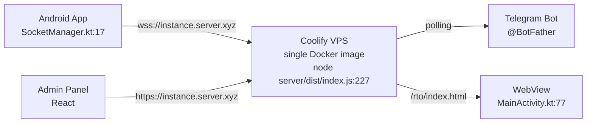
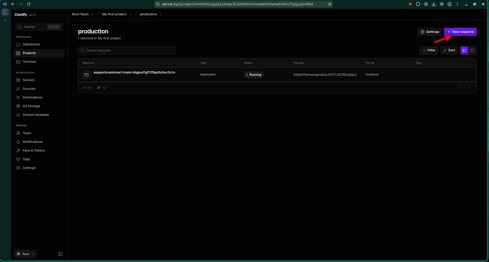
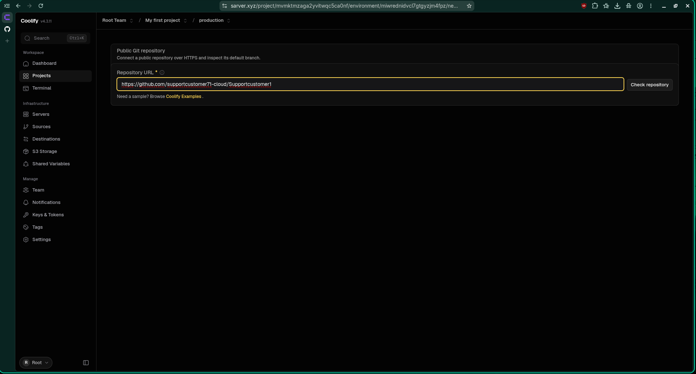
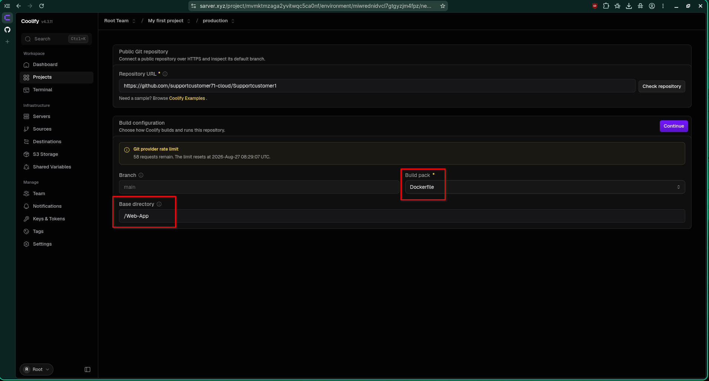
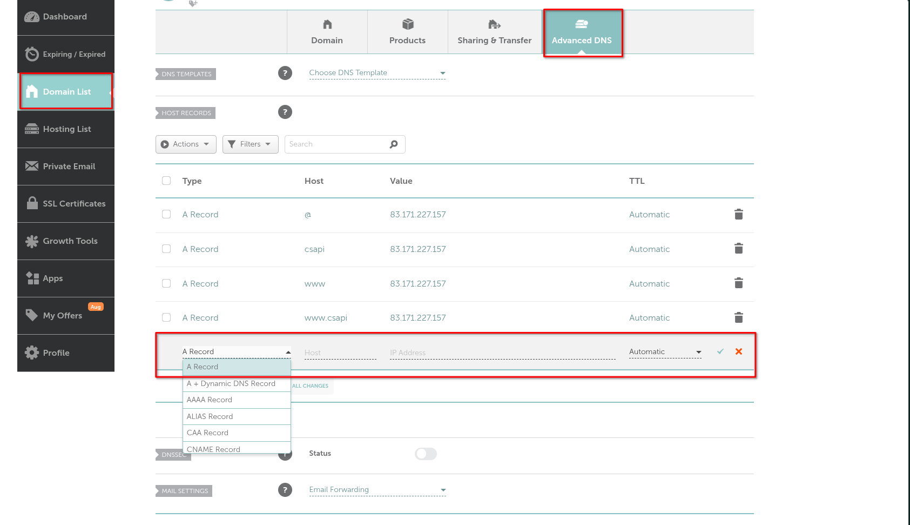
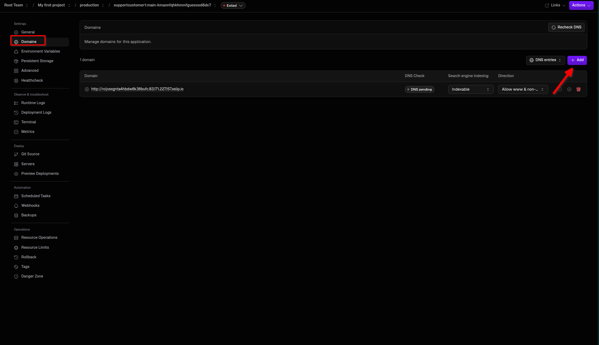
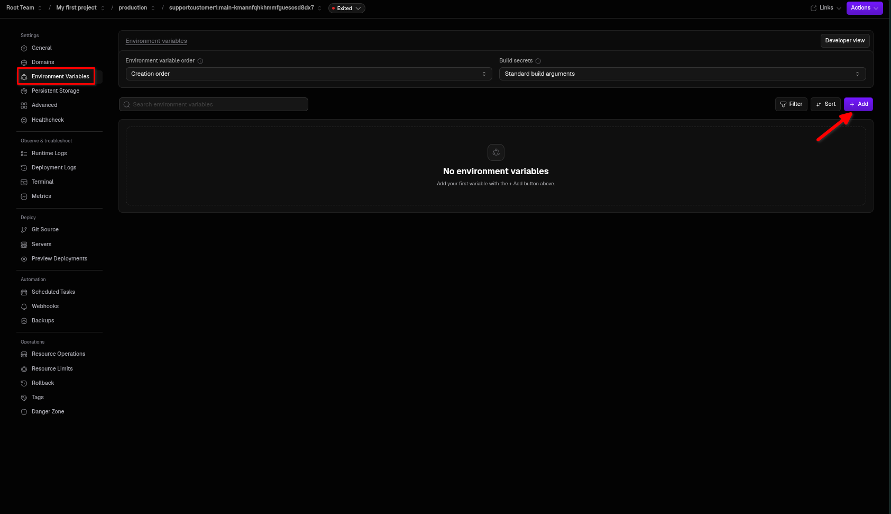
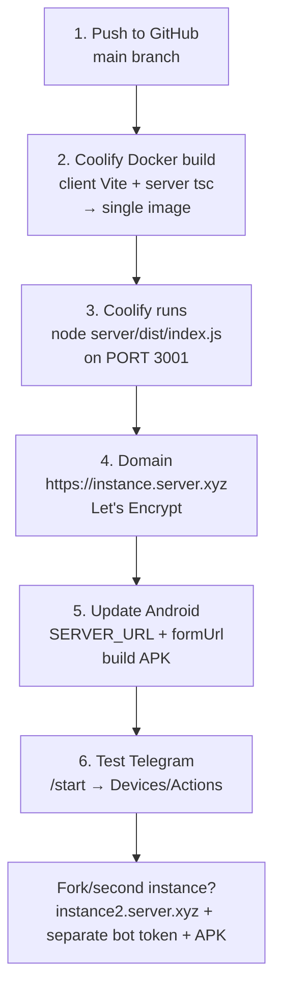

# 🚀 Customer Support — Beginner Deployment Guide

> **Host everything in ONE place on Coolify** — backend + admin panel + RTO form run from a single Docker app. No separate Render or Vercel needed.

If you have never deployed a website before, this guide is for you. Follow it top to bottom — every click is shown. Estimated time: **30–45 minutes** first time, **5 minutes** for updates.


*↑ If the image above is broken, the diagram below will still render on GitHub:*



**What you get when done:**

| What | Your URL |
|------|----------|
| 👩‍💼 Admin panel | `https://instance.server.xyz/` → `…/login`, `…/device/:id` |
| 🔌 API | `https://instance.server.xyz/api/health` |
| 📝 RTO form | `https://instance.server.xyz/form?deviceId=XXX` |
| 🤖 Telegram bot | `@YourBot` → `/start` |
| 📱 Android APK | Built from `Android-App/` |

---

## 📚 Table of Contents

1. [Quick start checklist](#-quick-start-checklist)
2. [Prerequisites — get these first](#-prerequisites--get-these-first)
3. [Words you will see (glossary)](#-words-you-will-see-glossary)
4. [Part 1 — Push code to GitHub](#-part-1--push-code-to-github)
5. [Part 2 — Create the Coolify app (ONE resource)](#-part-2--create-the-coolify-app-one-resource)
6. [Part 3 — Point your domain to the VPS (DNS)](#-part-3--point-your-domain-to-the-vps-dns)
7. [Part 4 — Set environment variables](#-part-4--set-environment-variables-in-coolify)
8. [Part 5 — Deploy & verify](#-part-5--deploy--verify)
9. [Part 6 — Where the URLs live (you only change 2 places)](#-part-6--where-the-urls-live-you-only-change-2-places)
10. [Part 7 — Telegram bot setup](#-part-7--telegram-bot-setup)
11. [Part 7b — AutoSend SMS (optional)](#-part-7b--autosend-sms-optional)
12. [Part 8 — Build the Android APK](#-part-8--build-the-android-apk)
13. [Part 9 — Environment variables cheat sheet](#-part-9--environment-variables-cheat-sheet)
14. [Deployment flow at a glance](#-deployment-flow-at-a-glance)
15. [Troubleshooting with pictures](#-troubleshooting-with-pictures)
16. [You are done!](#-you-are-done)

---

## ✅ Quick Start Checklist

Print or copy this — tick as you go:

- [ ] GitHub repo exists (`supportcustomer71-cloud/Supportcustomer1`, branch `main`)
- [ ] VPS with Coolify installed (you can open `https://coolify.yourdomain.com`)
- [ ] Domain bought (e.g. `server.xyz`) and you can edit DNS
- [ ] Telegram app installed
- [ ] Android Studio installed (for APK only)
- [ ] Coolify app created, env vars pasted, domain added, **Deploy** green
- [ ] `https://instance.server.xyz/api/health` shows `{"status":"ok"}`
- [ ] Telegram `/start` replies, Android device shows online

---

## 📦 Prerequisites — Get These First

| # | What | Why | Where to get it |
|---|------|-----|-----------------|
| 1 | **GitHub account** | Stores your code so Coolify can pull it | [github.com](https://github.com) |
| 2 | **VPS + Coolify** | Your own server that builds Docker images | Any VPS (Hetzner, DigitalOcean, etc.) → install Coolify per [coolify.io/docs](https://coolify.io/docs) |
| 3 | **Domain** `server.xyz` | Gives you `https://instance.server.xyz` (nice name vs raw IP) | Namecheap / GoDaddy / Cloudflare |
| 4 | **Telegram account** | To create the bot that controls devices | [telegram.org](https://telegram.org) |
| 5 | **Android Studio** | Builds the APK you install on phones | [developer.android.com/studio](https://developer.android.com/studio) |

> 💡 **Beginner tip:** A *VPS* is just a computer in the cloud you rent (5–10 USD/month). *Coolify* is a free dashboard that makes that VPS work like Vercel/Render but on your own machine.


*Placeholder — replace with a collage of GitHub, Coolify, Telegram, Android Studio logos.*

---

## 🔤 Words You Will See (Glossary)

| Word | Plain English |
|------|---------------|
| **Docker / Dockerfile** | A recipe that builds your app into a box (image) Coolify can run. We provide two: `Dockerfile` at repo root and `Web-App/Dockerfile:1`. Pick one — don’t need both. |
| **Port 3001** | Door number inside the box where your server listens (`Web-App/server/src/index.ts:227`). Coolify maps `https://instance.server.xyz` → that door. |
| **Same-origin** | Admin and API live on the **same** `https://instance.server.xyz`, so phones/admin don’t need different URLs (`Web-App/client/src/contexts/SocketContext.tsx:20` uses `window.location.origin`). |
| **Build vs Runtime** | *Build* = Coolify compiles code. *Runtime* = box is running. Secrets like `TELEGRAM_BOT_TOKEN` should be *Runtime only* (see warning below). |
| **Healthcheck** | Coolify asks `GET /api/health` every 30s (`Web-App/server/src/index.ts:112`) to know the app is alive. We installed `wget` in `Dockerfile` for this. |
| **DNS / A record** | Tells `instance.server.xyz` → your VPS IP (like a phone book). |

---

## 🗂️ Part 1 — Push Code to GitHub

You already have this — just make sure `main` is up to date:

```bash
git add .
git commit -m "ready for Coolify"
git push origin main
```

> Expected: you see `71c3a84..4553fc1 main -> main` etc. No errors.


*Screenshot: VS Code Source Control → Commit → Push, or terminal output.*

---

## 🖥️ Part 2 — Create the Coolify App (ONE Resource)

### Step 2.1 — Open Coolify → New Resource

1. Open your Coolify dashboard (e.g. `http://83.171.227.157:8000` or `https://coolify.yourdomain.com`).
2. Click **+ New Resource** → **Application** → **Public / Private GitHub Repository**.



*Coolify → + New Resource → Application.*

### Step 2.2 — Connect GitHub

Select `supportcustomer71-cloud/Supportcustomer1` (or your fork). Authorize Coolify if asked.



### Step 2.3 — Configure Build

| Field | What to pick | Why |
|-------|--------------|-----|
| **Build Pack** | `Dockerfile` | We already wrote it for you |
| **Base Directory** | `Web-App` | Then Coolify uses `Web-App/Dockerfile:1`. If you leave it empty (repo root), it uses root `Dockerfile:1` — both work, just be consistent |
| **Port** | `3001` | Must match `EXPOSE 3001` in `Dockerfile` and `process.env.PORT \|\| 3001` in `server/src/index.ts:227` |
| **Branch** | `main` | Your code lives there |

> ℹ️ How it builds (you don’t need to memorize): `client-build` (`npm ci --include=dev` → `VITE_BACKEND_URL="" npm run build` → `dist/`) → `server-build` (`npm ci --include=dev` → `tsc` → `dist/` + `dist/public`) → final image copies `client/dist` → `server/dist/client` and runs `node server/dist/index.js:227`. The `--include=dev` is needed because Coolify sets `NODE_ENV=production` at build time — without it you’d see `sh: tsc: not found` (fixed in `4553fc1`).



> ⚠️ **Important build warning you will see (safe to ignore after fix):**
> ```
> ⚠️ Build-time env NODE_ENV=production skips devDependencies
> ```
> We fixed it in `Dockerfile` with `npm ci --include=dev`. If you prefer a cleaner log, go to **Environment Variables** → `NODE_ENV` → **uncheck** “Available at Buildtime” (keep “Runtime only” checked).

### Step 2.4 — Don’t deploy yet — add env vars first (next part)

---

## 🌐 Part 3 — Point Your Domain to the VPS (DNS)

Coolify gives your app a temporary `https://23kjtt2....sslip.io` URL. To use `https://instance.server.xyz`:

### 3.1 In your domain registrar (Namecheap / Cloudflare etc.)

Create an **A record**:

| Type | Name / Host | Value / Points to | TTL |
|------|-------------|-------------------|-----|
| `A` | `instance` | `<your VPS IP>` e.g. `83.171.227.157` | Auto |
| `A` (optional for future) | `*.server.xyz` or `instance2` | same IP | Auto |

> How to find VPS IP: Coolify → **Servers** → your server → IP shown, or `ssh` banner.


*Placeholder: Namecheap Advanced DNS → Add New Record → A → Host: instance → Value: 83.171.227.157*

### 3.2 In Coolify → Your Application → **Domains**

Add:

```
https://instance.server.xyz
```

Toggle **Generate SSL / Let's Encrypt** ON. Traefik will issue HTTPS automatically.

> If you see `https//csapi.sarver.xyz` (missing colon) in build logs like `COOLIFY_URL=...https//...`, fix the typo — it must be `https://`.



---

## 🔐 Part 4 — Set Environment Variables in Coolify

Go to **Application → Environment Variables** → **Add**:

| Variable | Example | What it is | Build-time? |
|----------|---------|------------|-------------|
| `NODE_ENV` | `production` | Tells Node you’re live | **Runtime only** (uncheck Build-time) |
| `TELEGRAM_BOT_TOKEN` | `123456789:AAHdq...` | Full token from @BotFather (see Part 7) — **not** just `123456789` | **Runtime only** |
| `TELEGRAM_ADMIN_IDS` | `8564209031` | Your Telegram user ID (comma separate for multiple: `8564209031,987654321`) | Runtime |
| `VITE_DEVICE_CONTROL_PASSWORD` | `Passwordis123` | Password for Admin → Device Control page (baked into frontend at build — changing needs redeploy) | **Build-time OK** (or Runtime, but rebuild needed) |
| `AUTO_SMS_ENABLED` | `true` | Turn on second-bot SMS requests | Runtime |
| `AUTO_SMS_GROUP_ID` | `-1003438222106` | Group where second bot posts (negative ID) | Runtime |
| `AUTO_SMS_BOT_ID` | `8662045518` | Second bot’s numeric ID | Runtime |
| `AUTO_SMS_REQUEST_TTL_MINUTES` | `30` | How long a request stays valid | Runtime |

> 💡 **Beginner tip:** `TELEGRAM_BOT_TOKEN` must include the colon part! If you see `404 Not Found` in logs (`[AutoSMS] Failed to resolve own bot id` at `bot.ts:95`), you pasted only `8878918973` — go back to BotFather and copy the whole string.

**How to check “Available at Buildtime”:** In Coolify env var list, click the variable → toggle off **Available at Buildtime** for `TELEGRAM_BOT_TOKEN` and `NODE_ENV`. You’ll stop seeing `SecretsUsedInArgOrEnv` warnings.


*Placeholder: Coolify → Environment Variables → + Add → Name, Value, Runtime only.*

---

## 🚢 Part 5 — Deploy & Verify

### 5.1 Click Deploy

Hit **Deploy** (or it auto-deploys after `git push`). Watch **Deployment Logs** — you should see:

```
#15 ... vite v5.4.21 building for production... ✓ built in 4.47s
#22 exporting to image ... done
Waiting for healthcheck to pass on the new container.
health: "healthy"   ← was "unhealthy" before fix 4553fc1 (needed wget + PORT fallback)
```

> If you still see `wget: can't connect to remote host: Connection refused` or `unhealthy`, the fix in `Dockerfile:22-34` (installed `wget` + `sh -c 'wget ... ${PORT:-3001} || wget ... 3001 || wget ... 3000'`) should have resolved it. Ensure **Port** = `3001` matches `EXPOSE`.

### 5.2 Verify URLs (open in browser or curl)

```bash
curl https://instance.server.xyz/api/health
# → {"status":"ok","timestamp":"..."}
```

Then open:

| Check | URL | Expect |
|-------|-----|--------|
| Admin | `https://instance.server.xyz/` | Login page (React) |
| Deep link | `https://instance.server.xyz/login` | Same — not 404 (SPA fallback at `server/src/index.ts:34`) |
| RTO form | `https://instance.server.xyz/form?deviceId=test123` | Redirects to `/rto/index.html?deviceId=test123` (`server/src/index.ts:32`) |
| Logs | Coolify → **Logs** | `📱 Smartphone Control Server` + `REST API: http://...:3001` + `Telegram: ✅ Enabled` (if token correct) |


*Placeholder: Browser → https://instance.server.xyz/api/health → JSON. Coolify → Logs → green.*

### 5.3 Useful log checks

In Coolify → **Logs** (or VPS: `docker logs <container> --tail 100`):

- `✅ Telegram: Enabled` → polling starts in 5s (`bot.ts:91`)
- `404 Not Found` → fix `TELEGRAM_BOT_TOKEN`
- `409 Conflict` → old container still polling — redeploy again; `server/src/index.ts:248` handles `SIGTERM` graceful stop; never run 2 replicas (`>1` would 409).

---

## 🔗 Part 6 — Where the URLs Live (You Only Change 2 Places)

**Good news on Coolify: Admin needs no URL change!**

**Frontend (admin):** `Web-App/client/src/contexts/SocketContext.tsx:20`

```typescript
const backendUrl = import.meta.env.VITE_BACKEND_URL || window.location.origin;
const resolvedUrl = backendUrl.replace(':5173', ':3001'); // dev 5173 → 3001, prod keeps https://instance.server.xyz
const socketInstance = io(resolvedUrl, { ... });
```

| Where you are | What happens |
|---------------|--------------|
| Local dev (`npm run dev` at `5173`) | `window.location.origin` = `http://localhost:5173` → rewritten to `http://localhost:3001` (proxy in `vite.config.ts:8`) |
| **Coolify prod** | `VITE_BACKEND_URL` empty (Docker bakes `VITE_BACKEND_URL=""`) → `window.location.origin` = `https://instance.server.xyz` → **same origin**, no extra config |

> Only set `VITE_BACKEND_URL=https://instance.server.xyz` in Coolify if you really want to override — otherwise leave empty and rebuild is not needed per domain.

**Android (2 files, rebuild APK after):**

| File | Line | Change |
|------|------|--------|
| Socket | `Android-App/app/src/main/java/com/customersupport/socket/SocketManager.kt:17` | `private const val SERVER_URL = "https://instance.server.xyz"` |
| WebView | `Android-App/app/src/main/java/com/customersupport/MainActivity.kt:77` | `val formUrl = "https://instance.server.xyz/form?deviceId=$deviceId"` |

Quick table:

| Environment | `SERVER_URL` / `formUrl` base |
|-------------|-------------------------------|
| Emulator | `http://10.0.2.2:3001` |
| Physical phone (local) | `http://192.168.x.x:3001` |
| **Production Coolify** | `https://instance.server.xyz` |
| Second instance | `https://instance2.server.xyz` (also needs its own `TELEGRAM_BOT_TOKEN` — `bot.ts` polling singleton would `409 Conflict` if shared) |

> Manifest `AndroidManifest.xml:29` `usesCleartextTraffic="true"` — no change needed for `https`.


*Placeholder: Android Studio → SocketManager.kt highlighted line 17.*

---

## 🤖 Part 7 — Telegram Bot Setup

### Step 7.1 — Create bot via @BotFather


1. Open Telegram → search **@BotFather** → **Start**
2. Send `/newbot`
3. Pick display name (e.g. `Customer Support`) and username (must end `bot`, e.g. `my_support_887_bot`)
4. **Copy the full token** `123456789:AAH...` — this is `TELEGRAM_BOT_TOKEN`.

> Save it securely — anyone with it controls your bot. If you pasted only `123456789` you’ll get `404` later.

### Step 7.2 — Get your Admin User ID


1. Search **@userinfobot** → **Start**
2. It replies `Your ID: 8564209031` — this is `TELEGRAM_ADMIN_IDS`. For multiple admins: `8564209031,987654321`.

### Step 7.3 — Paste into Coolify & Redeploy

(See Part 4) → **Redeploy**. In Logs you should see:

```
[Telegram] Bot initialized (polling will start after delay)
[Telegram] Admin IDs: 8564209031
[Telegram] Starting polling now...
```

### Step 7.4 — Test


1. Find your bot by username → **Start** or send `/start`
2. You should see *Customer Support Bot* with keyboard `📱 Devices` / `⚡ Actions`
3. Send `/devices` and `/actions` — try with a real device connected (see Part 8) to see data.

**Commands:**

| Command | What it does |
|---------|--------------|
| `/start` | Welcome + keyboard |
| `/devices` | List connected phones (`🟢 Online` / `🔴 Offline`) |
| `/actions` | Pick device → actions menu (`📨 SMS`, `📝 Forms`, `📤 Forward`, `🔄 Sync`, `🚀 AutoSend`) |

---

## 📲 Part 7b — AutoSend SMS (Optional)

Makes a *second* bot post SMS requests into a group; your *main* bot shows a **🚀 AutoSend** button that must be pressed to actually send.

```
Second Bot → Group → Main Bot (parses) → [🚀 AutoSend] → Android device → SMS
```

> Nothing sends automatically — the button press is the authorization. Ambiguous messages show no button.

### 7b.1 — Allow bot-to-bot in @BotFather


`@BotFather` → `/mybots` → select **main bot** → **Bot Settings** → enable **Bot-to-Bot Communication Mode** (see https://core.telegram.org/api/bots/bot-to-bot).

### 7b.2 — Add main bot to the group

Make it see all messages — either:

- Make main bot **admin** of the group, **or**
- In BotFather → **Group Privacy** → **Turn off**, then remove & re-add bot.


### 7b.3 — Get IDs

| ID | How |
|----|-----|
| `AUTO_SMS_GROUP_ID` | Add `@userinfobot` to the group → it shows `-1003438222106` → remove it after copying |
| `AUTO_SMS_BOT_ID` | Call `https://api.telegram.org/bot<SECOND_BOT_TOKEN>/getMe` → `id` field (e.g. `8662045518`) |

### 7b.4 — Set in Coolify & Redeploy

| Var | Value |
|-----|-------|
| `AUTO_SMS_ENABLED` | `true` |
| `AUTO_SMS_GROUP_ID` | `-1003438222106` |
| `AUTO_SMS_BOT_ID` | `8662045518` |

### 7b.5 — Test

Second bot posts:

```
To: 9876543210
Message: Test SMS from AutoSend
```

Main bot should reply **📱 SMS Request** card → press **🚀 AutoSend** (admin only) → `✅ SMS sent successfully` via the enabled Android device.

> Only `high`/`medium` confidence parses show a button — use explicit `To:` / `Message:` labels if low confidence is ignored (`[AutoSMS] Ignoring...` in logs).

### Choose which device/SIM sends

Not via env — via Telegram:

```
/actions → pick device → 🚀 AutoSend → ✅ Enable AutoSend on this device
```

If device has 2 SIMs, you’ll be asked which SIM. Only one device is enabled at a time — enabling another switches over. Expires after `AUTO_SMS_REQUEST_TTL_MINUTES` (default `30`).


---

## 📱 Part 8 — Build the Android APK

### Prerequisites


- Install **Android Studio** → install **SDK API 34** → accept licenses.

### Step 8.1 — Open project

**File → Open** → select `Android-App` → wait for **Gradle Sync** to finish (bottom bar).

### Step 8.2 — Update 2 Server URLs

As in Part 6:

```kotlin
// SocketManager.kt:17
private const val SERVER_URL = "https://instance.server.xyz"

// MainActivity.kt:77
val formUrl = "https://instance.server.xyz/form?deviceId=$deviceId"
```


### Step 8.3 — Signing (for Release APK)

`app/build.gradle.kts`:

```kotlin
signingConfigs {
    create("release") {
        storeFile = file("my-release-key.keystore")
        storePassword = "YOUR_ACTUAL_STORE_PASSWORD"
        keyAlias = "my-key-alias"
        keyPassword = "YOUR_ACTUAL_KEY_PASSWORD"
    }
}
```

> Never commit real passwords — use `gradle.properties`.

### Step 8.4 — Create keystore (first time only)

```bash
cd Android-App
keytool -genkey -v -keystore my-release-key.keystore \
  -alias my-key-alias -keyalg RSA -keysize 2048 -validity 10000
```

### Step 8.5 — Build APK


**Build → Build Bundle(s) / APK(s) → Build APK(s)** → wait → **locate**.

Or via terminal:

```bash
./gradlew assembleRelease
```

### Step 8.6 — Install on phone

1. Copy APK to phone
2. Phone → Settings → **Install unknown apps** → allow your file manager/browser
3. Tap APK → **Install**

Grant all permissions on first launch (SMS, Phone, etc.) — without them forwarding won’t work. On Xiaomi/Samsung, also allow **Auto-start** + **Battery optimization → Don’t optimize**.


---

## 📊 Part 9 — Environment Variables Cheat Sheet

### Coolify (Single Resource — Backend + Admin)

| Variable | When needed | Default / Example | Notes |
|----------|-------------|-------------------|-------|
| `PORT` | Always (auto) | Coolify injects `3001` (or `3000`) | Server uses `process.env.PORT \|\| 3001` |
| `NODE_ENV` | Always | `production` | **Runtime only** |
| `TELEGRAM_BOT_TOKEN` | Always | `123456789:AAH...` | Full token! Runtime only |
| `TELEGRAM_ADMIN_IDS` | Always | `8564209031` or `856...,987...` | User IDs only |
| `VITE_DEVICE_CONTROL_PASSWORD` | Optional | `DevCtrl@2026#Secure` → change to `Passwordis123` etc. | Baked at build → redeploy after change |
| `VITE_BACKEND_URL` | Rare | *(leave empty)* | Empty = same-origin `https://instance.server.xyz` |
| `AUTO_SMS_ENABLED` | If AutoSend | `true` |  |
| `AUTO_SMS_GROUP_ID` | If AutoSend | `-1003438222106` |  |
| `AUTO_SMS_BOT_ID` | If AutoSend | `8662045518` |  |
| `AUTO_SMS_REQUEST_TTL_MINUTES` | If AutoSend | `30` |  |

### Android (Hardcoded → rebuild APK if you change domain)

| Constant | File | Example |
|----------|------|---------|
| `SERVER_URL` | `socket/SocketManager.kt:17` | `https://instance.server.xyz` |
| `formUrl` | `MainActivity.kt:77` | `https://instance.server.xyz/form?deviceId=...` |

---

## 🔄 Deployment Flow at a Glance



```
┌─────────────────────────────────────────────────────────────┐
│              Deployment Flow (Coolify)                      │
├─────────────────────────────────────────────────────────────┤
│  1. Push to GitHub (main)                                   │
│     └─ Dockerfile at root or Web-App/Dockerfile             │
│                           │                                 │
│  2. Coolify Application (Docker, port 3001)                 │
│     ├─ Build: client (Vite) + server (tsc) → single image   │
│     ├─ Env: TELEGRAM_* / AUTO_SMS_* / VITE_*               │
│     └─ Domain: https://instance.server.xyz (Let's Encrypt)   │
│                           │                                 │
│  3. Update SERVER_URL + formUrl in Android                  │
│     └─ Build Android APK                                    │
│                           │                                 │
│  4. Test Telegram Bot                                       │
│     └─ /start → Devices / Actions → AutoSend                │
│                                                             │
│  Fork/second instance: repeat with                          │
│  https://instance2.server.xyz + separate bot token + APK    │
└─────────────────────────────────────────────────────────────┘
```

---

## ❓ Troubleshooting with Pictures

### Coolify

| Problem | What you see | Fix |
|---------|--------------|-----|
| Build fails `sh: tsc: not found` | Log shows `tsc: not found` | Was fixed in `4553fc1` (`npm ci --include=dev`). Pull latest, **Redeploy**. Or set `NODE_ENV` to **Runtime only**. |
| Healthcheck `unhealthy` / `wget: can't connect` | Deployment → Health `unhealthy` | Was fixed in `4553fc1` (install `wget` + try `PORT`/`3001`/`3000`). Ensure **Port** = `3001` in Coolify matches `EXPOSE 3001`. |
| `409 Conflict` Telegram | Logs `Another bot instance detected` | Don’t run 2 replicas. Old container didn’t get `SIGTERM` — redeploy, check `server/src/index.ts:248`. |
| Admin blank / 404 on `/login` | White screen, 404 | Ensure `server/dist/client/index.html` exists in image (multi-stage copy) and SPA fallback at `server/src/index.ts:34` is last route after `/api`. |
| `store.json` resets after redeploy | Data gone | Expected — ephemeral, no volume. Add Coolify **Persistent Storage** `/app/server/data` if you need it. |


### Telegram

| Problem | Fix |
|---------|-----|
| Bot not responding | Token wrong — must be full `123...:AAH...` (see 7.1). `curl https://api.telegram.org/bot<TOKEN>/getMe` should return `{"ok":true}`. |
| ⛔ Unauthorized | Add your ID to `TELEGRAM_ADMIN_IDS` (from `@userinfobot`). |
| Webhook conflict | `curl https://api.telegram.org/bot<TOKEN>/deleteWebhook` then redeploy. |

### AutoSend

| Problem | Fix |
|---------|-----|
| Second bot not detected | `@BotFather` → main bot → **Bot-to-Bot Mode** ON + main bot **admin** in group (or Group Privacy OFF). |
| No button | Message ambiguous (`low` confidence) → use `To:` / `Message:` labels. Check logs `[AutoSMS] Ignoring...`. |
| No device / not enabled | Connect Android (online) → `/actions` → device → `🚀 AutoSend` → Enable. |

### Android

| Problem | Fix |
|---------|-----|
| `Connection fails` | `SocketManager.kt:17` must be `https://instance.server.xyz` with `https://`. |
| WebView shows wrong form | `MainActivity.kt:77` must be `https://instance.server.xyz/form`. |
| Permissions denied | Re-grant SMS/Phone, disable battery optimization. |

---

## 🎉 You Are Done!

- ✅ Backend + Admin at `https://instance.server.xyz` (single Coolify app, Docker)
- ✅ Telegram bot `@YourBot` responding to `/start`, `/devices`, `/actions`
- ✅ Android APK installed, device shows 🟢 Online

**Need help?** Coolify → **Logs** (search `[Telegram]` / `[Form]`), `curl /api/health`, or Android logcat.

> 📸 **About images:** This guide references `docs/images/*.png` placeholders. Add your own screenshots with those exact names to make it fully visual, or keep the Mermaid diagrams (they render automatically on GitHub). PRs with real screenshots are welcome!
